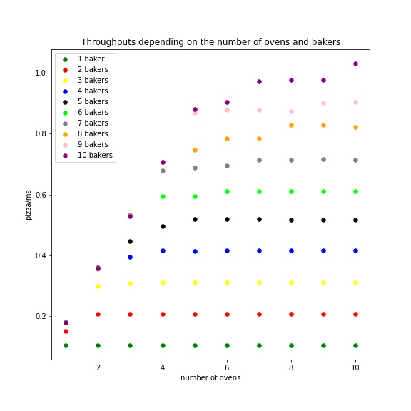

# PizzaGo

This is an implementation of a Pizza Maker, it runs a pizzeria that must serve a given amount of pizzas.

## Requirement

To be able to use a yaml configuration file, the package [yaml](https://github.com/go-yaml/yaml) was used, to install it, run:

    go get gopkg.in/yaml.v2


## Configuration

To run the program, two possibilities are available :

### Using a yaml config file

The folder config provide a [sample file](configs/config.yml) that can be used and modified. An example of such file is shown below.
```yml
# Config file for PizzaGo
# Each value must be an integer strictly positive

times: # Times to perform each step in miliseconds
  process: 1
  prepare: 2
  bake: 5
  qualityCheck: 1
parameters: 
  NumberOfWorkers: 2   # Number of workers in the pizzeria
  NumberOfOvens: 2     # Number of Ovens in the pizzeria
  NumberOfOrders: 500  # Number of Orders to take

```

### By specifying all arguments on the command line

In order to be able to run the program many times with different parameters, it is also possible to input all the parameters values when typing the ```go run``` command in the order described below.
## How to run it

The project can be run as follow :

    go run [Path to main.go] [path to config.yml]

or as follow :

    go run [Path to main.go] [processTime] [preparationTime] [bakingTime] [qualityCheckTime] [nbOfWorkers] [nbOfOvens] [nbOfOrders]

For example, when trying to run the project from its root using the sample config file:

    go run cmd/pizzeria/main.go configs/config.yml

Or when trying to run the project from its root using the values as above :

    go run cmd/pizzeria/main.go 1 2 5 1 2 2 500


## Descriptions of the project

### [Config](internal/config/config.go)
The config package is simply here to read the yaml file, verify some property on the contained values and populate a ```Config``` struct that will be used by the rest of the packages.

### [Timing](internal/components/timing.go)
The timing file is used to provide an abstraction to the process of waiting for the differents times given in the config file.

### [Pizza Bakers](internal/components/pizzaBaker.go)

Pizza bakers are working together concurently to serve all pizzas as fast as possible. The number of pizza bakers can be configured using the ```NumberOfBakers``` field of the config file.

A baker has an uid that goes from 1 to ```NumberOfBakers```.

A pizza baker job is simple, if all the clients' orders have not been taken yet, he takes an order and prepares the pizza. 

To bake the pizza, two cases can happen :

- If there are at least as many oven than pizza bakers, then an oven has been attributed to the baker so he can just use it to bake the pizza.
- Otherwise, he tries to find an oven he can use, if no oven is available, he waits until one is.

Once the pizza is baked, the pizza baker can finally check its quality and repeat the process for the next client.

If all clients have been served, he can go to sleep.

### [Clients and Orders](internal/components/pizzeria.go)

We assume that clients are already waiting in front of the store at the begining of the "day", (i.e. bakers will never wait for clients)

The number of clients is given in the ```NumberOfOrders``` field of the config file.

To monitor which client's order has already been taken, the counter ```OrderTaken``` is implemented in the pizzeria file. It is incremented by one each time a pizza baker takes a new order. Such order will have an uid corresponding to the value of the counter after this incrementation.

An order will hence have an uid that goes from 1 to ```NumberOfOrders```

To ensure that two bakers do not take the same order twice in the confusion, access to this counter is done using atomic operations. Another option would have been to attribute a specific slice of the client list to each baker. (for example baker1 has orders 1 to 100, baker2 has orders 101 to 200, etc...) however this would mean that clients' orders are not taken in order, which is not consistent with the reality.

### [Ovens](internal/components/oven.go)

The number of ovens can be configured using the ```NumberOfOvens``` field of the config file.

An oven can hold one pizza at a time and takes the time specified in the config file field ```bake``` to cook a pizza.

The field ```isUsed``` of the ```PizzaOven``` struct is used by pizza bakers looking for an empty oven to know if it is available. If it is equal to 0, this means that the oven is available, otherwise, it is set to the uid of the pizza worker currently using it.
This field is always read or written using atomic operations to ensure that two bakers don't try to use it at the same time. It acts as a lock.

### [Pizzeria](internal/components/pizzeria.go)

This is the entry point of the pizzeria. Its function ```StartPizzeria``` is in charge of reading the config file, creating the ovens and bakers and starting each baker's Goroutine. The function will return the average latency (i.e. time for an order to be treated) once each Goroutine has finished.

## Concurency in the project

During this project, concurency was used several times, indeed, since each worker is running in its own Goroutine, all elements that are accessed by more than one of them must been accessed carefully.

### The order counter
To increment the client's queue ```OrderTaken```, bakers are using ```atomic.AddUint64``` to ensure their incrementation is indeed done properly.

Before taking the order of a new client, bakers are checking the following condition to know when there are no more client:

````go
atomic.LoadUint64(&OrderTaken) < Config.Parameters.NumberOfOrders)
````

One issue is that between this check and the incrementation of ```OrderTaken```, it is possible that more bakers than needed manage to pass the condition and hence we would end up with more orders taken than the actual number of orders.

To avoid this issue we could have used a lock, however we check the following condition after incrementing the counter instead :

````go
orderId := atomic.AddUint64(&OrderTaken, 1)
	if orderId > Config.Parameters.NumberOfOrders {
		atomic.SwapUint64(&OrderTaken, Config.Parameters.NumberOfOrders)
		return Order{orderId}, errors.New("Oups, I took an order that was out of bound")
	}
````
It consists in reverting the counter if one worker went "too far".

### The ovens

Ovens are the other objects that are accessed by all workers. To improve a bit the efficiency of the pizzeria, as explained earlier, two cases are possible :

- If there are at least as many oven than pizza bakers, then an oven has been attributed to the baker based on its uid. Hence each worker will only access his own oven and there are no concurrency involved

- The second case is more interesting. If there are more pizza bakers than ovens, then at some point it might be possible that 2 pizza bakers try to use the same oven concurrently. 

We will talk about the second case here. To ensure that only one baker uses a given oven at a time, we use atomic operations again. The code that is in charge of locking an oven and releasing it can be found in the two methods ```findOven``` and ```releaseOven``` of [pizzaBaker](internal/components/pizzaBaker.go).

The field ```isUsed``` of an oven is its lock, indeed, when a baker is looking for an oven, he will call ```findOven``` that will iterate on the oven list trying to perform the following :
````go
atomic.CompareAndSwapUint64(&(ovenList[i].isUsed), 0, w.Name)
````
When the ```CompareAndSwapUint64``` returns true, he knows for sure that ```isUsed``` has been set to his uid and that anyone trying to claim the oven using the ```CompareAndSwapUint64``` will fail as ```isUsed``` is no longer 0.

To release the oven, the worker atomically swaps the value back to 0 in a similar way:
```go
atomic.CompareAndSwapUint64(&(o.isUsed), w.Name, 0)
```

### The delivered Orders counter

The counter ```timeTakenTakingOrders``` is the last object accessed concurrently, the same logic as the order counter is used here as it is only incremented using the following function:
```go
atomic.AddUint64(&timeTakenTakingOrders, uint64(elapsed))
```

## Analysis of the throughput and the latency

### Theoritical versus Real values

Compared to the theoritical values, the real ones can vary a lot depending on multiple factors. For example, the OS or the load on the computer at the moment the code is ran can have influence on its running time.

One variable found when implementing the project was the time taken by the following call used to simulate the time taken by each step of the pizza making:
```go
time.Sleep(time.Duration(t) * time.Millisecond)
```
indeed, according to the ```time``` package [documentation](https://pkg.go.dev/time#Sleep),
> Sleep pauses the current goroutine for at least the duration d

We hence have no guarranty that the sleep function will sleep exactly for the time specified, depending on the environment, it might in fact be much more. The fact that the bakers are waiting for ovens by looping indefinitly might also cause other Goroutines' call to sleep to takes more time depending on how Goroutine are treated by the OS.

### Throughput

To obtain values for the throughput of the system, the go's benchmarking framework has been used, it can be found in [pizzeria_test.go](internal/components/pizzeria_test.go). It consist in timing multiple times runs of the pizzeria with different ```NumberOfWorkers``` and ```NumberOfOvens``` parameters. The used configurations are described here :

````yaml
# Config file for PizzaGo
# Each value must be an integer strictly positive

times: # Times to perform each step in miliseconds
  process: 1
  prepare: 2
  bake: 5
  qualityCheck: 1
parameters: 
  NumberOfWorkers: from 1 to 10   # Number of workers in the pizzeria
  NumberOfOvens: from 1 to 10     # Number of Ovens in the pizzeria
  NumberOfOrders: 200  # Number of Orders to take

````

The configuration is run using the following command in the internal/components/ directory:


    go test -bench=. -benchtime=10s -timeout=30m

The [results](results/throughputs/raw_throughputs.txt) are converted (i.e we divide the number of pizza baked by the runnings time) and shown in the graph below, they are also available in a [text file](results/throughputs/treated_throughputs.txt)



### Latency

To obtain latencies we run the main function with differents parameters and check the value returned by ```StartPizzeria``` as it return the average latency of the run.
